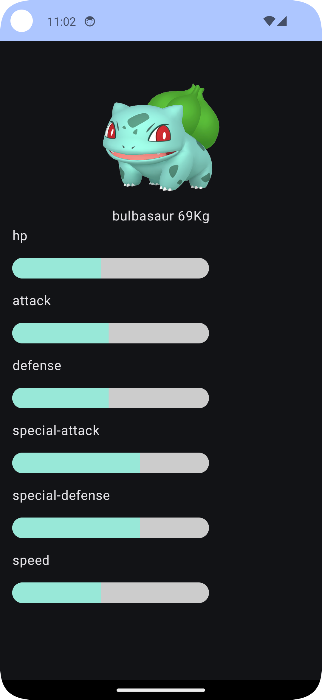
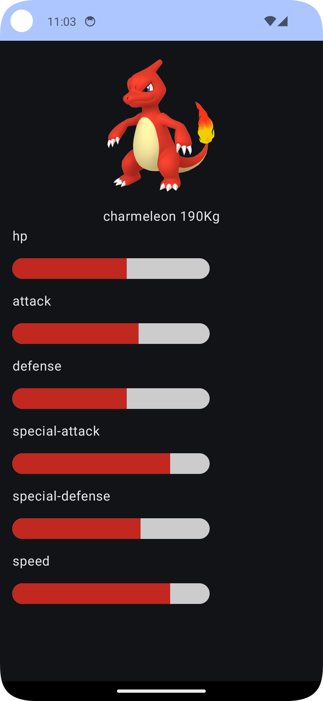

# Pokedex_Compose
The Pokedex Compose project is using some latest technologies about the Android Jetpack Compose.

# The Project Contain the following technologies
Kotlin - https://kotlinlang.org/docs/getting-started.html
Jetpack Compose https://developer.android.com/develop/ui/compose  
Jetpack Compose Navigation - New Share Element Technology - 
https://fvilarino.medium.com/shared-element-transitions-in-jetpack-compose-8f553078101e - https://getstream.io/blog/shared-element-compose/   
Retrofit for Network Manager https://square.github.io/retrofit/ - https://github.com/square/retrofit  
Room Database https://developer.android.com/training/data-storage/room  
Palette (Using the Pokemon Color to paint the Linear Indicator with the same color) - https://developer.android.com/develop/ui/views/graphics/palette-colors  
KSP - https://developer.android.com/build/migrate-to-ksp - https://github.com/google/ksp  
Coil For Compose - https://coil-kt.github.io/coil/compose/ - https://coil-kt.github.io/coil/ - https://github.com/coil-kt/coil  
Hilt Dependencies Injection - https://developer.android.com/training/dependency-injection/hilt-android   

# Others technologies
View Model  
Repository  
Offline Support  

# Examples

  
  
  

Target SDK version: 34  
Minimum SDK version: 27  
Kotlin version: 1.9.23  
Gradle version: 8.4.0  

# Feeds/Urls/End Point (parsing some data from the response)
## (Links References for Ends Points)
https://pokeapi.co/  
https://github.com/PokeAPI/sprites (GitHub)  

# References
https://fvilarino.medium.com/shared-element-transitions-in-jetpack-compose-8f553078101e  
https://getstream.io/blog/shared-element-compose/   
