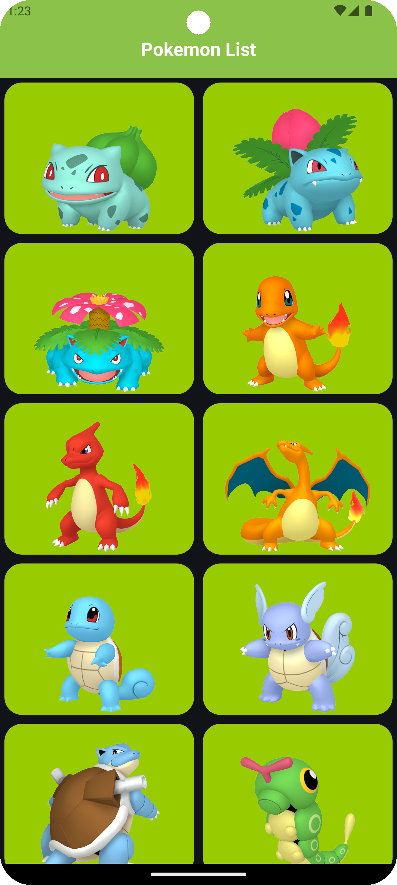
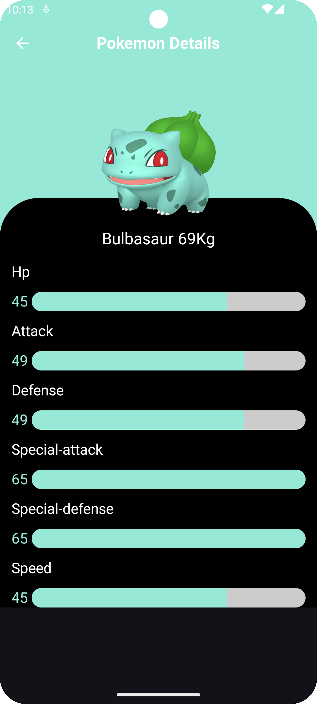
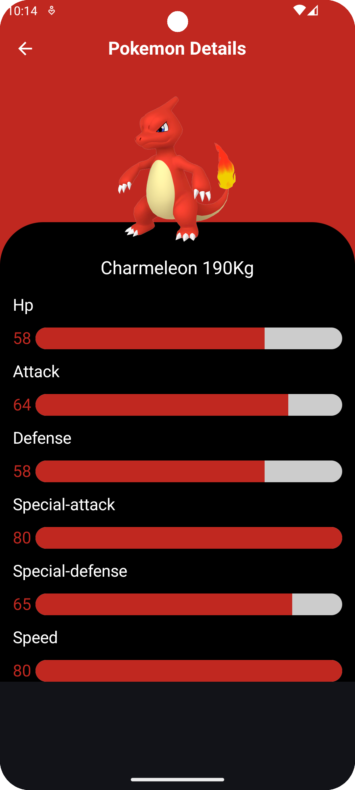
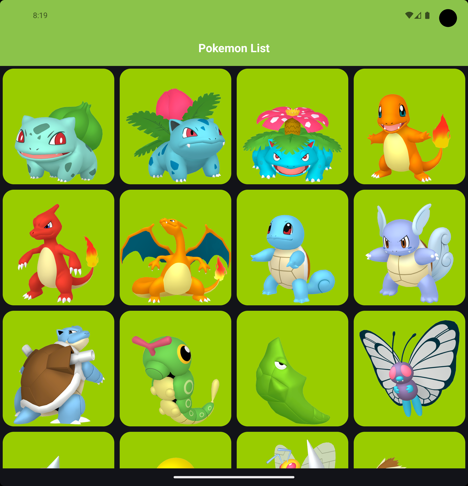

# Pokedex Compose  Pokédex App

A modern Pokédex app for Android built with the latest technologies recommended by Google. This
project showcases a clean, scalable architecture and a fluid user interface using Jetpack Compose.

> [!IMPORTANT]  
> A similar project is also available in Flutter (Dart)!  
> 👉 **[Pokedex_Flutter](https://github.com/NicosNicolaou16/Pokedex_Flutter)** 👈

## ✨ Features

* **Modern UI:** Built entirely with **Jetpack Compose** for a declarative and intuitive UI.
* **Dynamic Theming:** Extracts prominent colors from Pokémon images using the **Palette API** to
  create dynamic and immersive detail screens.
* **Seamless Transitions:** Implements the new **Shared Element Transition** for smooth navigation
  between the list and detail views.
* **Offline Support:** Caches Pokémon data using **Room Database**, allowing the app to work
  offline.
* **Efficient Networking:** Fetches data from the [PokéAPI](https://pokeapi.co/) using **Retrofit**.
* **Optimized Performance:** Leverages **Coroutines** for asynchronous operations, **KSP** for
  faster annotation processing, and **R8** for code shrinking.
* **Scalable Architecture:** Follows the **MVVM** pattern with a repository, ensuring a clean
  separation of concerns and maintainable code.
* **Navigation:** Leverages **Navigation 3** and its **Type Safety** features for robust,
  compile-time checked, and error-free navigation.

## 📸 Screenshots & Demos

  
  
  
  
  

  
  &nbsp;
  

## 🛠️ Tech Stack & Libraries

This project is built with **[Kotlin](https://kotlinlang.org/docs/getting-started.html)** and
utilizes a variety of modern Android libraries and tools:

- **UI:** [Jetpack Compose](https://developer.android.com/develop/ui/compose), [Coil](https://coil-kt.github.io/coil/compose/) (
  Image
  Loading), [Palette API](https://developer.android.com/develop/ui/views/graphics/palette-colors)
- **Architecture:** [MVVM](https://developer.android.com/topic/architecture#recommended-app-arch), [UI State Management](https://developer.android.com/topic/architecture/ui-layer/events#handle-viewmodel-events)
- **Asynchronicity:** [Kotlin Coroutines](https://kotlinlang.org/docs/coroutines-overview.html), [Kotlin KTX](https://developer.android.com/kotlin/ktx)
- **Navigation:** [Navigation Compose 3](https://developer.android.com/guide/navigation/navigation-3), [Navigation Type Safety](https://medium.com/androiddevelopers/navigation-compose-meet-type-safety-e081fb3cf2f8), [Shared Element Transition](https://developer.android.com/develop/ui/compose/animation/shared-elements)
- **Data:** [Retrofit](https://square.github.io/retrofit/) (
  Networking), [Room](https://developer.android.com/training/data-storage/room) (Database)
- **Dependency Injection:** [Hilt](https://dagger.dev/hilt/)
- **Build & Optimization:** [KSP](https://developer.android.com/build/migrate-to-ksp), [R8](https://developer.android.com/build/shrink-code)
- **Custom Components:** [PercentageWithAnimation](https://github.com/NicosNicolaou16/PercentagesWithAnimationCompose)
  for displaying Pokémon stats built by [@NicosNicolaou16](https://github.com/NicosNicolaou16).

## 🔧 Versioning

- **Target SDK:** **36**
- **Minimum SDK:** **29**
- **Kotlin Version:** **2.3.10**
- **Gradle Version:** **9.0.1**

## 📚 APIs & References

### Data Sources

- **Primary API:** [PokéAPI (pokeapi.co)](https://pokeapi.co/)
- **Image Sprites:** [PokeAPI/sprites on GitHub](https://github.com/PokeAPI/sprites)

### Articles & Inspiration

- **Shared Element Transitions:**
    - [Shared Element Transitions in Jetpack Compose](https://fvilarino.medium.com/shared-element-transitions-in-jetpack-compose-8f553078101e)
    - [Building a Shared Element Transition in Jetpack Compose](https://getstream.io/blog/shared-element-compose/)
- **Type-Safe Navigation:**
    - [Navigation-Compose meets Type-Safety](https://medium.com/androiddevelopers/navigation-compose-meet-type-safety-e081fb3cf2f8)
- **UI/UX Design Inspiration:**
    - [Dribbble - Pokedex App by Alexandr](https://dribbble.com/shots/6540871-Pokedex-App) (Note:
      Used as inspiration, not a direct copy)
- **App Icon:**
    - Derived
      from [Fandom Ideas Wiki](https://ideas.fandom.com/wiki/Pok%C3%A9_Ball_Pok%C3%A9mon_Ideas_(Super_Smash_Bros._series)?file=Pok%C3%A9_Ball_Redraw_by_oykawoo.png)

## ⭐ Stargazers

If you enjoy this project, please give it a star!
Check out all the stargazers
here: [Stargazers on GitHub](https://github.com/NicosNicolaou16/Pokedex_Compose/stargazers)

---

## 🙏 Support & Contributions

This library is actively maintained. Feedback, bug reports, and feature requests are welcome! Please feel free to **open an issue** or submit a **pull request**.

<!--# Pokedex_Compose

This Pokedex - Pokemon app is a project that contain and apply the latest Android technologies
recommended by Google such as Jetpack Compose, the new way to build the design.
Also, it contains some other important technologies such as Room Database, KSP, Hilt Dependencies
Injection, the new Shared Element Transaction and new Navigation Type Safety.  

> [!IMPORTANT]  
> Similar project with Flutter (Dart Language) :
> point_right: [Pokedex_Flutter](https://github.com/NicosNicolaou16/Pokedex_Flutter) :point_left:  

# Examples

  
  
  
  
  

  
  &nbsp;
  

# The Project Contain the following technologies

The programming language is the [Kotlin](https://kotlinlang.org/docs/getting-started.html), it is a
modern, JVM-based programming language that is concise, safe, and interoperable with Java.  
[Kotlin Coroutines](https://kotlinlang.org/docs/coroutines-overview.html) is used for asynchronous
tasks.  
[Kotlin KTX](https://developer.android.com/kotlin/ktx) is a collection of Kotlin extensions that
offer more concise and expressive code for working with Android APIs and libraries.
The UI is build using [Jetpack Compose](https://developer.android.com/develop/ui/compose).  
For Navigation between screens is use
the [New Navigation Type Safety](https://medium.com/androiddevelopers/navigation-compose-meet-type-safety-e081fb3cf2f8).  
For Animation and Navigation from the main screen to details screen is use the
new [Shared Element Transition](https://developer.android.com/develop/ui/compose/animation/shared-elements). ([Shared Element Transition - Article](https://fvilarino.medium.com/shared-element-transitions-in-jetpack-compose-8f553078101e), [Shared Element Transition - Article](https://getstream.io/blog/shared-element-compose/))   
[Retrofit](https://square.github.io/retrofit/) is responsible for making requests and retrieving
data from the remote server. ([Repository](https://github.com/square/retrofit))  
[Room Database](https://developer.android.com/training/data-storage/room) is responsible for saving
the retrieved data from the remote server, querying data from the local database, and supporting
offline functionality.   
[Palette](https://developer.android.com/develop/ui/views/graphics/palette-colors) is used to
retrieve the color from the image; in our case, we are using the Pokémon color to paint the linear
indicator with the same color.  
[KSP](https://developer.android.com/build/migrate-to-ksp) ("Kotlin Symbol Processing") is a tool for
efficient annotation processing in Kotlin, providing faster code generation and symbol manipulation
compared to KAPT. [Repository](https://github.com/google/ksp)  
[Coil](https://coil-kt.github.io/coil/compose/) for Jetpack Compose is a library that it is
responsible for loading the images
asynchronous. ([Coil Documentation](https://coil-kt.github.io/coil/), [Repository](https://github.com/coil-kt/coil))  
[Hilt Dependencies Injection](https://developer.android.com/training/dependency-injection/hilt-android)
is an Android library that simplifies dependency injection by using annotations to automatically
manage and provide dependencies across components, built on top of
Dagger. ([Documentation](https://dagger.dev/hilt/))  
[MVVM](https://developer.android.com/topic/architecture#recommended-app-arch) with repository is an
architecture where the Repository manages data sources (e.g., network, database), the ViewModel
processes the data for the UI, and the View displays the UI, ensuring a clear separation of
concerns.  
[UI State](https://developer.android.com/topic/architecture/ui-layer/events#handle-viewmodel-events)
to initial, loading, loaded and error.  
[R8](https://developer.android.com/build/shrink-code) enabled, is a code shrinker and obfuscator for
Android that optimizes and reduces the size of APKs by removing unused code and resources, while
also obfuscating the remaining code to improve security.  
[Navigation 3](https://developer.android.com/guide/navigation/navigation-3) for Jetpack Compose is a
modern, Compose-native navigation system where you manage a
stack of serializable destination keys and display them with NavDisplay, giving you direct control,
state retention, and flexible adaptive UI without traditional graphs or routes.  
The percentage for showing the skills of each Pokémon is calculated using
the [PercentageWithAnimation](https://github.com/NicosNicolaou16/PercentagesWithAnimationCompose)
built by [@NicosNicolaou16](https://github.com/NicosNicolaou16).  

# Versioning

Target SDK version: 36  
Minimum SDK version: 29  
Kotlin version: 2.3.0  
Gradle version: 9.0.0  

# Feeds/Urls/End Point (parsing some data from the response)

## (Links References for Ends Points)

- https://pokeapi.co/  
- https://github.com/PokeAPI/sprites (GitHub)  

# References

- https://fvilarino.medium.com/shared-element-transitions-in-jetpack-compose-8f553078101e  
- https://getstream.io/blog/shared-element-compose/   
- https://medium.com/androiddevelopers/navigation-compose-meet-type-safety-e081fb3cf2f8   
- https://dribbble.com/shots/6540871-Pokedex-App# - Get some UI - not completely use it (CHECK THE
  LINK FOR THE DESIGN)   
- https://ideas.fandom.com/wiki/Pok%C3%A9_Ball_Pok%C3%A9mon_Ideas_(Super_Smash_Bros._series)?file=Pok%C3%A9_Ball_Redraw_by_oykawoo.png -
  app icon <bf />
- https://ideas.fandom.com/wiki/Pok%C3%A9_Ball_Pok%C3%A9mon_Ideas_(Super_Smash_Bros._series) - app
  icon <bf />
-->